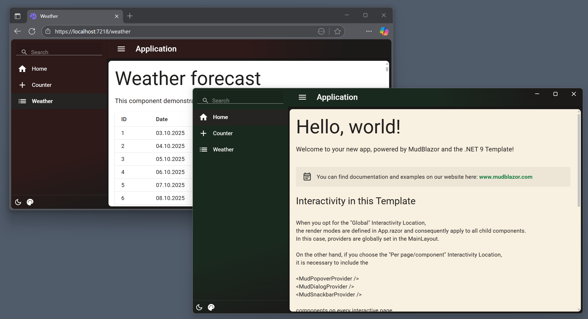
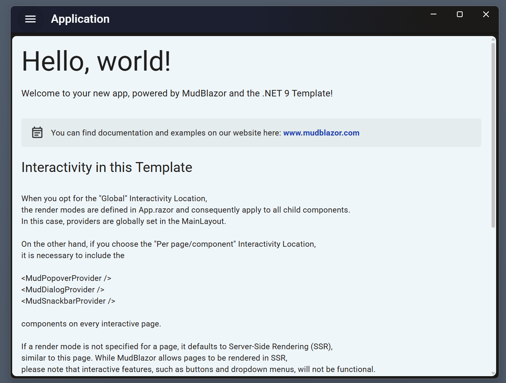
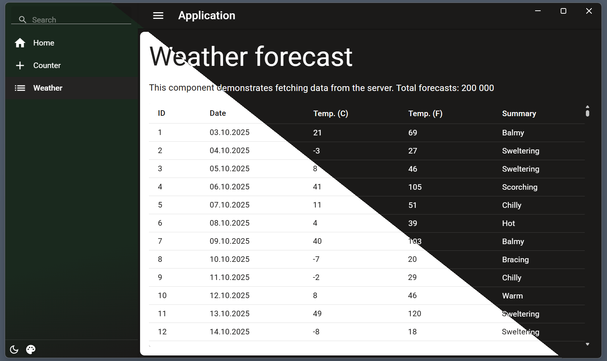
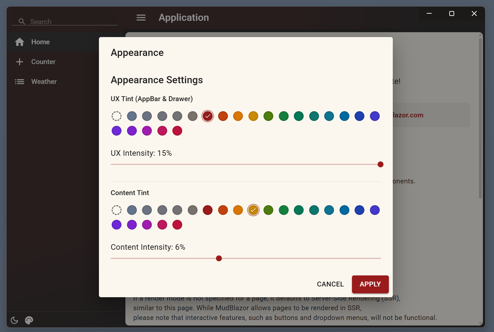

# MudBlazor SSR/WASM with ElectronSharp

I am testing [MudBlazor](https://github.com/MudBlazor/MudBlazor) SSR/WASM mixed with [ElectronSharp](https://github.com/theolivenbaum/electron-sharp) working both in the Browser and on the Desktop with .NET 10.

## Screenshots

### Browser and Electron Side-by-Side

### Main View

### Appearance Settings

## Features

- [MudBlazor](https://github.com/MudBlazor/MudBlazor) components with Material Design
- Mixed SSR and WebAssembly rendering modes
- [ElectronSharp](https://github.com/theolivenbaum/electron-sharp) desktop application support
- Custom theming with UX and content color tints
- Adjustable theme intensity controls
- Virtualized data tables with 200,000 row support
- Dark and light mode toggle
- Works in both browser and desktop environments

## Technology Stack

- .NET 10
- [MudBlazor](https://github.com/MudBlazor/MudBlazor)
- Blazor SSR/WASM
- [ElectronSharp](https://github.com/theolivenbaum/electron-sharp)
